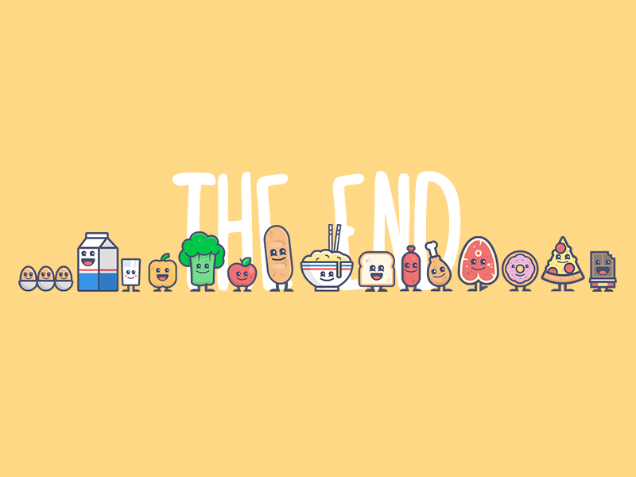

<body>
<h1 align="center"> ⬇️ 𝙒𝙚𝙡𝙘𝙤𝙢𝙚 𝙩𝙤 𝙢𝙮 𝙥𝙧𝙤𝙛𝙞𝙡𝙚 ⬇️ </h1>
 

 

<h2 align="center"> 💬 𝘼𝙗𝙤𝙪𝙩 𝙢𝙚 🗨️ </h2>

<li>
<b>Name:</b> Emanuel</li>
<li>
<b>Gender:</b> Male
</li>
<li>
<b>Hobby:</b> Tech stuff, web development, anime, games, guitar
</li>
 

<b>     Thanks for reading about my personal stuff 
                                 💯❤️‍🔥</b>

<h2 align="left">            📇 𝙆𝙣𝙤𝙬𝙡𝙚𝙙𝙜𝙚/ 𝙆𝙣𝙤𝙬𝙣 𝙖𝙗𝙤𝙪𝙩 📇</h2>

       
    
   

 

I'm mostly working with <b><i>CSS, HTML, Javascript</i></b> and <b><i>ReactJS</i></b> for the <b>Front-end</b> and <b><i>Node.JS, Express</i></b> for the <b>Back-end</b> and deploy with <b>Heroku, Netlify, Vercel</b>

 
<h2 align="right">📝 𝘾𝙤𝙣𝙩𝙖𝙘𝙩 𝙢𝙚 📝            </h2>

 

Here are some of my   
most used social info ヽ(o＾▽＾o)ノ

 

 

 

    <h2 align ="center">⚔️ Stats 𝙇𝙀𝙑𝙀𝙇 𝙐𝙋! 🛡️</h2>
    
     
 
  
  
  

 
 
 
 
 
 

<h2 align="center">💖 𝙏𝙝𝙖𝙣𝙠𝙨 𝙛𝙤𝙧 𝙬𝙖𝙡𝙠𝙞𝙣𝙜 𝙩𝙝𝙧𝙤𝙪𝙜𝙝 𝙢𝙮 𝙥𝙧𝙤𝙛𝙞𝙡𝙚! 💖</h2>

</body>
